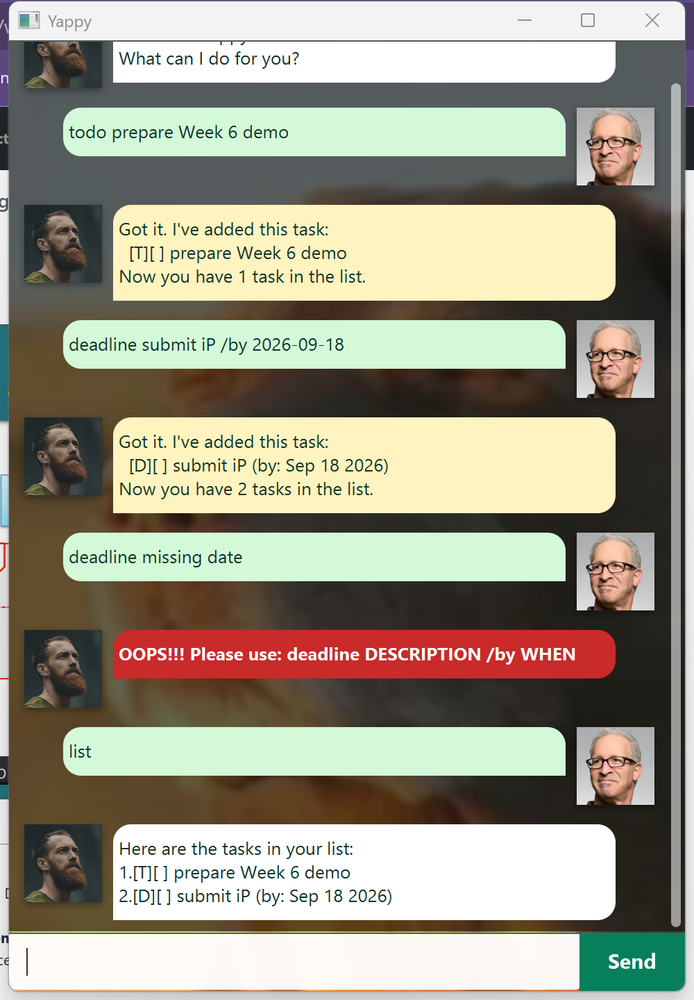

# Yappy User Guide

Yappy is a desktop task manager for people who want a quick way to record tasks,
find them later, and check approaching deadlines.



## Quick start

Yappy requires Java 25. Put `Yappy.jar` in the folder where you want Yappy to
store its data, open a terminal in that folder, and run:

```text
java -jar "Yappy.jar"
```

Type a command in the input box and press **Enter**, or select **Send**. The
conversation scrolls as it grows, and the window can be resized. User messages
and Yappy's replies use different layouts; invalid commands appear in a red
bubble. Use `bye` to show Yappy's farewell and close the window.

## Commands at a glance

| Command | Purpose |
| --- | --- |
| `todo DESCRIPTION` | Add a task without a date. |
| `deadline DESCRIPTION /by DATE` | Add a task due on a date. |
| `event DESCRIPTION /from DATE /to DATE` | Add an event date range. |
| `list` | List all tasks. |
| `find KEYWORD` | List tasks whose description contains the keyword. |
| `remind DAYS` | List incomplete deadlines due today through the next number of days. |
| `mark NUMBER` / `unmark NUMBER` | Mark a task done or not done. |
| `delete NUMBER` | Delete a task. |
| `bye` | Exit Yappy. |

`list` and `bye` take no extra arguments. Date markers must appear exactly
once and in the shown order; Yappy reports a specific error for duplicated or
misordered markers instead of changing the task list.

Task numbers shown by `list`, `find`, and `remind` start at 1. Only numbers
from the main task list can be used with `mark`, `unmark`, or `delete`.

## Adding tasks

Add a todo when it has no date:

```text
todo borrow book
```

Add a deadline using a valid calendar date:

```text
deadline submit report /by 2026-09-18
```

Yappy displays it as:

```text
[D][ ] submit report (by: Sep 18 2026)
```

Add an event with an inclusive start and end date. The end date cannot be
before the start date; a same-day event is allowed.

```text
event orientation /from 2026-09-14 /to 2026-09-18
```

## Viewing and finding tasks

Use `list` to view every task. Use `find` to search descriptions without
case sensitivity:

```text
find REPORT
```

Search results are numbered independently for display. Use the task number from
`list`, rather than a number from `find`, when marking, unmarking, or deleting.

## Getting deadline reminders

`remind DAYS` shows incomplete deadlines from today up to and including the
specified number of days ahead. It does not change the task list, and it omits
completed and overdue deadlines so the result focuses on upcoming work.

```text
remind 7
```

If no deadline is due in that period, Yappy confirms that the reminder list is
clear. `DAYS` must be a whole number of zero or more; `remind 0` checks only
today's deadlines.

## Managing tasks

Use task numbers from `list` to change a task's status or remove it:

```text
mark 2
unmark 2
delete 3
```

## Automatic saving and recovery

Yappy saves the task list automatically after adding, marking, unmarking, or
deleting a task. The saved data is stored in `data/yappy.txt` relative to the
folder from which Yappy runs.

- If the file or its parent folder is missing, Yappy starts with an empty list
  and creates them when it first saves.
- If individual saved records are malformed, Yappy skips only those records,
  keeps the valid tasks, and reports how many records were skipped.
- If the data file cannot be read, Yappy warns you and starts with an empty list.
- If a change cannot be saved, Yappy reports the storage error instead of
  claiming that it was saved.

## Errors

Yappy reports invalid commands without changing the task list. Command words
are case-insensitive, and surrounding spaces or extra spaces after a command
word are accepted. Check that:

- task descriptions and search keywords are not blank;
- task numbers are whole numbers within the range shown by `list`;
- reminder days are whole numbers of zero or more;
- dates are real calendar dates in `yyyy-MM-dd` format; and
- `/by`, `/from`, and `/to` appear exactly once where required, with `/from`
  before `/to`.

## Acknowledgements

Yappy builds on the NUS CS2103 iP starter project and JavaFX tutorial structure.
The upstream contributors are listed in the repository's
[CONTRIBUTORS.md](https://github.com/itsDanielGuan/ip/blob/master/CONTRIBUTORS.md).
